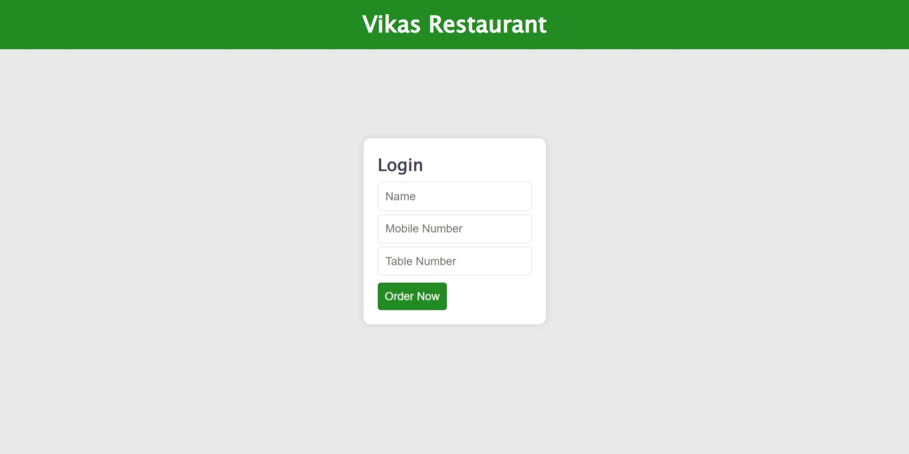
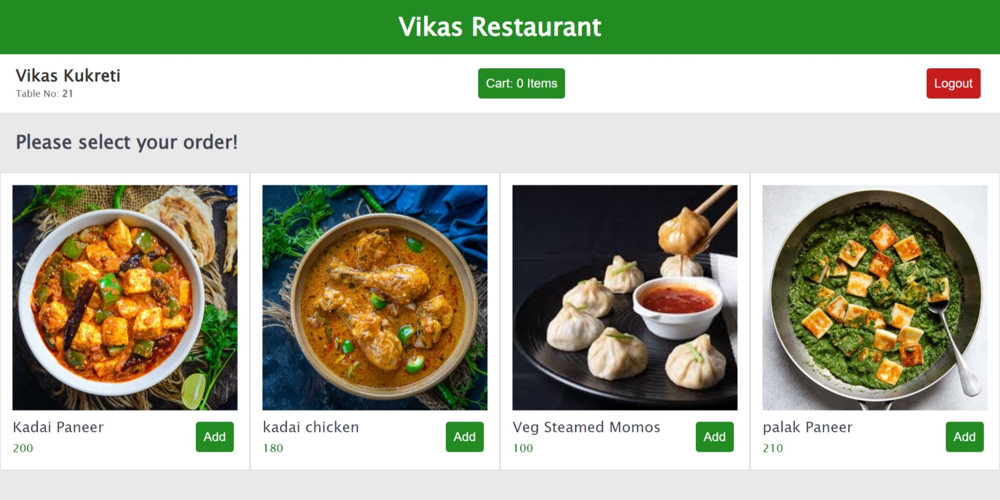
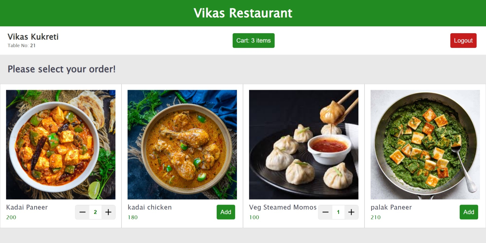
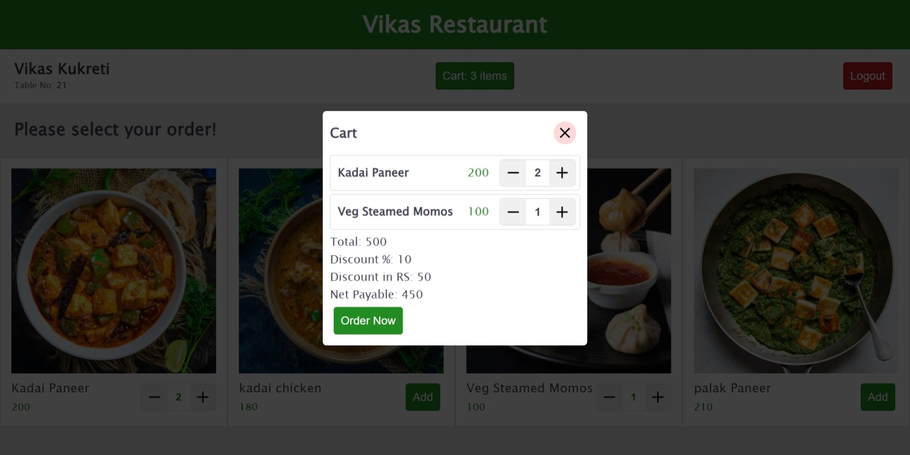
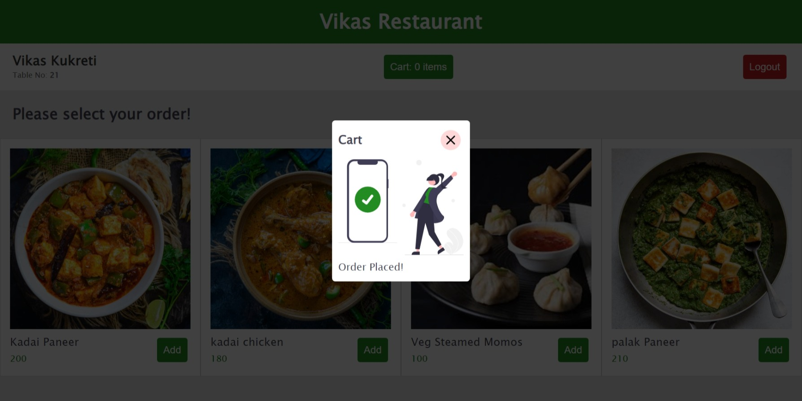

# Restaurant Web Application
A simple restaurant application that user can use once he gets into the restaurant to place his/her order. 

## Features
- Login using mobile number and table number
- View Available Dishes
- Add to Cart & Order
- TODO: See user orders in dashboard
- TODO: Accept/Reject Orders

## Screenshots

## Thank you
🤟 Happy Coding